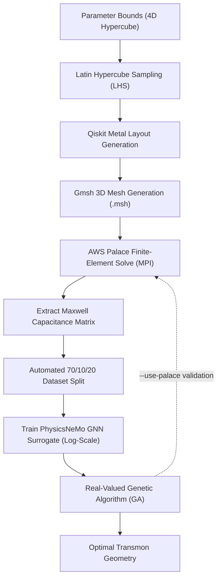

# Quantum Optimization Pipeline

[](https://www.python.org/)
[](Dockerfile)
[](https://awslabs.github.io/palace/)
[](https://github.com/NVIDIA/physicsnemo)
[](https://qiskit-community.github.io/qiskit-metal/)
[](tests/)

A hybrid CAD and machine learning framework for superconducting transmon qubit design optimization. The pipeline integrates **Qiskit Metal** parameterization, **SQDMetal** + **AWS Palace** finite-element capacitance simulation, an **NVIDIA PhysicsNeMo** surrogate neural network, and a **real-valued Genetic Algorithm (GA)**.

---

## Design Space & Target Objectives

The optimizer navigates a 4-dimensional geometric and circuit parameter space to match user-defined Hamiltonian energy levels:

| Parameter Key | Component | Description | Search Range | Physical Unit |
| :--- | :--- | :--- | :---: | :---: |
| `Q1.pad_width` | Transmon | Capacitor pad width | 300.0 to 600.0 | µm |
| `Q1.pad_height` | Transmon | Capacitor pad height | 20.0 to 80.0 | µm |
| `Q1.pad_gap` | Pocket | Gap between pad and ground plane | 10.0 to 40.0 | µm |
| `lj` | Junction | Josephson junction linear inductance | 6.0 to 14.0 | nH |

**Optimization Targets**:
- **Josephson Energy ($E_j$)**: Calculated from inductance $L_j$ (in MHz).
- **Charging Energy ($E_c$)**: Calculated from Maxwell self-capacitance $C_\Sigma$ via 3D electrostatics (in MHz).
- **Qubit Metrics**: Targets transition frequency $\omega_{01} \approx \sqrt{8 E_j E_c} - E_c$ and anharmonicity $\alpha \approx -E_c$ while enforcing the transmon dispersion threshold ($E_j / E_c \ge 40$).

---

## Architecture Flow



---

## Project Structure

```text
Opt/Quantum_Opt_Pipeline/
├── generate_samples.py       # Step 2: Parametric LHS sampling & Palace FEM simulations
├── train_surrogate.py        # Step 3: PhysicsNeMo GNN training with early stopping
├── optimize.py               # Step 4: Real-valued Genetic Algorithm optimization
├── pipeline.py               # Active learning & orchestration pipeline
├── setup_environment.sh      # Core environment setup script (native venv & Docker)
├── setup_env.sh              # Portable wrapper for environment setup
├── run_container.sh          # Docker container execution wrapper
├── Dockerfile                # Debian Bookworm lean container specification
├── pyproject.toml            # Project packaging specification
├── requirements-cpu.txt      # Lean CPU dependency requirements
├── requirements.txt          # CUDA-accelerated dependency requirements
├── src/                      # Core pipeline modules
│   ├── cad.py                # Qiskit Metal transmon geometry construction
│   ├── mesh.py               # Gmsh meshing and surface identification
│   ├── palace.py             # Palace config generator and MPI core allocator
│   ├── model.py              # PhysicsNeMo MeshGraphNet GNN architecture
│   └── genetic_algorithm.py  # SBX crossover, polynomial mutation & cost function
├── tests/                    # Automated pytest unit test suite
└── docs/                     # Modular topic documentation guides
```

---

## Quick Start Guide

Navigate to the pipeline directory:

```bash
cd Opt/Quantum_Opt_Pipeline
```

### Step 1: Environment Setup

Choose between containerized execution (Docker) or a local virtual environment:

```bash
# Option A: Containerized (Docker - recommended for reproducibility)
./setup_env.sh --docker
./run_container.sh pytest -q

# Option B: Native Virtual Environment (Python 3.11/3.12)
./setup_env.sh
source "${QUANTUM_DESIGN_ENV:-../../quantum_design_env}/.venv/bin/activate" 2>/dev/null || \
    source "./quantum_design_env/.venv/bin/activate"
```
- **What to expect**: Prepares a lean environment with `torch`, `physicsnemo`, `quantum-metal`, `SQDMetal`, and `gmsh` in 1–2 minutes. Unnecessary bloatware (PySide6/Qt, Jupyter, Ansys) is excluded.

---

### Step 2: Generate Training Samples via Palace

```bash
export PALACE_BIN="/path/to/palace"

python generate_samples.py \
    --output-root training_run \
    --samples 150 \
    --palace-bin "$PALACE_BIN"
```
- **What to expect**: Explores the 4D parameter box via Latin Hypercube Sampling. Reserves 10% of CPU cores for host OS stability and runs Palace across the remaining cores via OpenMPI (~10–15s per sample).
- **Outputs**: Produces `active_learning_log.csv` and auto-splits data into 70% `train_samples.csv`, 10% `validation_samples.csv`, and 20% `test_samples.csv`. Transient 3D field files (`.vtu`) are deleted automatically to save disk space.

---

### Step 3: Train PhysicsNeMo Surrogate

```bash
python train_surrogate.py \
    --data-log training_run/training_data/train_samples.csv \
    --test-log training_run/training_data/test_samples.csv \
    --checkpoint training_run/training_data/checkpoints/nemo_surrogate.mdlus \
    --epochs 2000 \
    --early-stopping-patience 200 \
    --evaluation-output training_run/training_data/checkpoints/training_evaluation.json
```
- **What to expect**: Fits the PhysicsNeMo GNN on $\log(E_j)$ and $\log(L_j)$ in ~15–45s. Stops automatically when validation loss plateaus and restores the best weights.
- **Outputs**: Writes `nemo_surrogate.mdlus`, `nemo_surrogate.state.pt`, and `training_evaluation.json` (reporting relative accuracy within 5%, MAE, and independent test score).

---

### Step 4: Run Genetic Algorithm Optimization

```bash
python optimize.py \
    --output-root optimization_run \
    --model-checkpoint training_run/training_data/checkpoints/nemo_surrogate.mdlus \
    --model-data-log training_run/training_data/train_samples.csv \
    --population 100 \
    --generations 20 \
    --palace-bin "$PALACE_BIN"
```
- **What to expect**: Evaluates 100 candidate designs per generation in ~2–5 seconds with real-time surrogate scoring. Variable generation loop automatically terminates as soon as the best candidate reaches within 5% of target parameters (or up to 20 max generations), simultaneously deleting old generation data to keep disk usage zero.
- **Outputs**: Writes winning parameters (`pad_width`, `pad_height`, `pad_gap`, and $L_j$) and predicted frequencies to `optimization_run/optimization_result.json`. Add `--use-palace` to run a live Palace simulation on the final winner.

---

### Step 5: Run Automated Tests

```bash
python -m pytest -q
```
- **What to expect**: Runs 17 unit tests in ~3 seconds, verifying genetic operators, variable stopping, math transforms, MPI bounds, and script syntax.

---

## CLI Options Cheatsheet

| Script | Option | Default | Description |
| :--- | :--- | :---: | :--- |
| `generate_samples.py` | `--samples` | `10` | Number of parametric samples to generate via LHS |
| | `--include-boundary-points` | `False` | Pin $2^4=16$ boundary corner points to prevent extrapolation |
| | `--palace-bin` | system | Path to AWS Palace executable binary |
| | `--seed` | entropy | Random seed for deterministic sample reproduction |
| `train_surrogate.py` | `--epochs` | `2000` | Maximum number of training epochs |
| | `--early-stopping-patience`| `200` | Epochs without validation improvement before early termination |
| | `--evaluation-output` | `None` | Path to export test-set performance metrics JSON |
| `optimize.py` | `--population` | `100` | Number of candidate designs per GA generation |
| | `--generations` | `20` | Maximum budget of variable generations to evolve |
| | `--target-tolerance` | `0.05` | Early stopping tolerance (stops when within 5% of target params) |
| | `--use-palace` | `False` | Run full-wave Palace validation solve on winning candidate |
| | `--mpi-procs` | dynamic | Override MPI rank count (capped at $\lceil 0.90 \times \text{cores} \rceil$) |

---

## Documentation

Detailed operational guides, mathematical formulations, and reference manuals are organized by topic in [`docs/`](docs/):

| Document | Topic | Description |
| :--- | :--- | :--- |
| **[Quick Start Guide](docs/quickstart.md)** | Step-by-Step | Complete end-to-end tutorial with detailed phase expectations and outputs. |
| **[Environment Setup](docs/setup.md)** | Setup & Dependencies | Docker build & run commands, native virtualenv, and lean dependency profile. |
| **[MPI Resource Policy](docs/mpi_policy.md)** | Resource Management | $\lceil 0.90 \times \text{cores} \rceil$ allocation reserving 10% for OS background tasks. |
| **[Sample Generation](docs/sampling.md)** | Design Exploration | Parameter bounds, Latin Hypercube Sampling, and 70/10/20 data partitioning. |
| **[Surrogate Modeling](docs/surrogate.md)** | Neural Network | PhysicsNeMo GNN architecture, log-scale physics transforms, and training. |
| **[Genetic Optimization](docs/optimization.md)** | Design Search | Real-valued GA engine, objective cost function, operators, and Palace validation. |
| **[Troubleshooting Guide](docs/troubleshooting.md)** | Diagnostics & FAQ | Solutions for missing libraries, solver errors, and runtime issues. |
| **[Next Version Roadmap](docs/roadmap.md)** | Research Roadmap | Plans for mesh-aware graph neural networks and physics-informed losses. |
