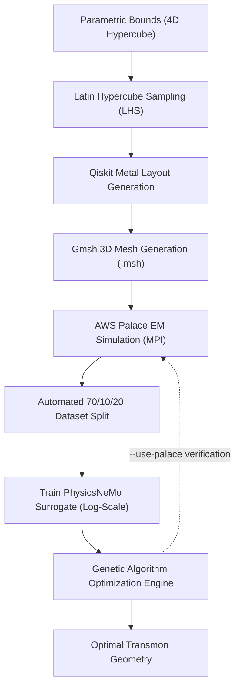

# Quantum Optimization Pipeline Documentation

Welcome to the documentation for the CDAC Quantum Optimization Pipeline. This repository provides a hybrid framework combining **Qiskit Metal**, **AWS Palace**, **NVIDIA PhysicsNeMo**, and a **Genetic Algorithm** to design and optimize superconducting transmon qubits.

---

## Documentation Index

Explore the documentation organized by topic:

| Document | Topic | Description |
| :--- | :--- | :--- |
| **[Quick Start Guide](quickstart.md)** | Step-by-Step Walkthrough | Complete end-to-end tutorial detailing commands and what to expect at each step. |
| **[Environment Setup](setup.md)** | Setup & Dependencies | Containerized Docker setup, virtual environment, and lean dependency profile. |
| **[MPI Resource Policy](mpi_policy.md)** | Resource Management | Automated $\lceil 0.90 \times \text{cores} \rceil$ allocation reserving 10% for OS stability. |
| **[Sample Generation](sampling.md)** | Dataset Exploration | Parameter bounds, Latin Hypercube Sampling, boundary coverage, and 70/10/20 splits. |
| **[Surrogate Modeling](surrogate.md)** | Neural Network | PhysicsNeMo GNN architecture, log-scale physics transforms, dropout uncertainty, and training. |
| **[Genetic Optimization](optimization.md)** | Design Search | Real-valued GA engine, objective cost function, crossover, mutation, and Palace validation. |
| **[Troubleshooting Guide](troubleshooting.md)** | Diagnostics & FAQ | Resolutions for common runtime, solver, and environment issues. |
| **[Next Version Roadmap](roadmap.md)** | Research & Future Work | Plans for mesh-aware PhysicsNeMo models and physics-informed loss functions. |

---

## Architecture Flow

---

## Quick Command Reference

| Phase | Script | Primary Command |
| :--- | :--- | :--- |
| **Setup (Docker)** | `setup_env.sh` | `./setup_env.sh --docker` |
| **Setup (Venv)** | `setup_env.sh` | `./setup_env.sh` |
| **Sampling** | `generate_samples.py` | `python generate_samples.py --output-root run_01 --samples 150` |
| **Training** | `train_surrogate.py` | `python train_surrogate.py --data-log run_01/training_data/train_samples.csv --test-log run_01/training_data/test_samples.csv` |
| **Optimization** | `optimize.py` | `python optimize.py --model-checkpoint run_01/training_data/checkpoints/nemo_surrogate.mdlus --model-data-log run_01/training_data/train_samples.csv` |
| **Testing** | `pytest` | `python -m pytest -q` |
