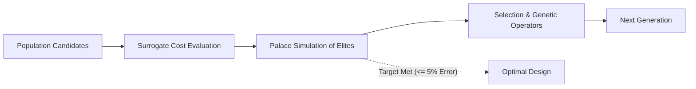

# Genetic Algorithm Optimization

The `optimize.py` script executes a real-valued Genetic Algorithm (GA) to discover transmon qubit geometry and circuit parameters that match target Hamiltonian energy levels ($E_j^{\text{target}}, E_c^{\text{target}}$).

---

## Objective Function

Candidates are scored using a normalized quadratic relative-error cost function:

$$
\text{Cost}(x) = \left(\frac{\hat{E}_j(x) - E_j^{\text{target}}}{E_j^{\text{target}}}\right)^2 + \left(\frac{\hat{E}_c(x) - E_c^{\text{target}}}{E_c^{\text{target}}}\right)^2
$$

Where $\hat{E}_j$ and $\hat{E}_c$ are predicted in real-time by the frozen PhysicsNeMo surrogate. The global optimum is $\text{Cost}=0$.

---

## Genetic Operators

The optimization engine uses real-valued continuous genetic operators:

1. **Tournament Selection**: Chooses the fittest individual among 3 randomly selected candidates.
2. **Elitism**: Clones the top 2 fittest candidates directly into the next generation without modification.
3. **Simulated Binary Crossover (SBX)**: Recombines parent parameters continuously with distribution index $\eta_c=2.0$.
4. **Polynomial Mutation**: Applies continuous perturbation with distribution index $\eta_m=20.0$ and mutation probability $p_m = 1/4 = 0.25$ per gene. Children are strictly clipped to fabrication bounds.



---

## Execution Modes

### Mode 1: Full Optimization with Live Palace Simulation (Default)

Evaluates the population with the surrogate, simulates the best ranking candidate(s) using AWS Palace after every generation, passes them as elites to the next iteration, and validates the final winning design:

```bash
python optimize.py \
    --output-root optimization_run \
    --model-checkpoint training_run/training_data/checkpoints/nemo_surrogate.mdlus \
    --model-data-log training_run/training_data/train_samples.csv \
    --population 100 \
    --generations 20 \
    --palace-bin "$PALACE_BIN"
```

### Mode 2: Surrogate-Only Optimization (`--no-palace`)

Evaluates all GA candidates strictly using the neural surrogate without running external finite-element simulations (useful for rapid testing or offline exploration):

```bash
python optimize.py \
    --output-root optimization_run \
    --model-checkpoint training_run/training_data/checkpoints/nemo_surrogate.mdlus \
    --model-data-log training_run/training_data/train_samples.csv \
    --population 100 \
    --generations 20 \
    --no-palace
```

---

## Variable Generations & Simultaneous Cleanup

1. **Variable Generations (Target Convergence)**:
   - The `--generations` argument (default: `20`) serves as a maximum budget ceiling.
   - At each generation, the best candidate is evaluated against target Hamiltonian parameters ($E_j^{\text{target}}, E_c^{\text{target}}$).
   - If the relative error of both parameters is within the tolerance threshold (default: `--target-tolerance 0.05` = 5%) and the transmon regime condition ($E_j / E_c \ge 40$) is satisfied, the algorithm terminates early.
2. **Simultaneous Generation Cleanup**:
   - Intermediate generation checkpoints (`generation_XX.json`) and previous transient data are deleted simultaneously each time the GA advances to a new generation.
   - Any stale Palace simulation folders are automatically pruned before final validation, keeping disk usage zero.

---

## Output Manifest

Results are written to `<output-root>/optimization_result.json`:

```json
{
  "best_parameters": {
    "Q1.pad_width": 485.23,
    "Q1.pad_height": 42.1,
    "Q1.pad_gap": 24.85,
    "lj": 9.15e-9
  },
  "best_metrics_mhz": {
    "Ej": 19850.5,
    "Ec": 322.1
  },
  "predicted_metrics_mhz": {
    "Ej": 19850.5,
    "Ec": 322.1
  },
  "target_metrics_mhz": {
    "Ej": 20000.0,
    "Ec": 320.0
  },
  "relative_error": {
    "Ej": 0.00748,
    "Ec": 0.00656,
    "max_error": 0.00748
  },
  "converged_within_tolerance": true,
  "target_tolerance": 0.05,
  "generations_completed": 7,
  "max_generations": 20,
  "population_size": 100,
  "best_cost": 0.000049,
  "result_source": "Frozen surrogate evaluation only"
}
```
