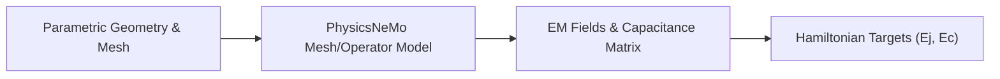

# Next Version Roadmap

This document records the next-generation improvements for the quantum
optimization pipeline. The current implementation is a custom
PhysicsNeMo-backed surrogate that consumes four scalar design parameters and
predicts `Ej` and `Ec`. The next version should add physics and mesh information
only where it improves measurable generalization.

## Current Boundary

The current model receives:

```text
[Q1.pad_width, Q1.pad_height, Q1.pad_gap, lj]
```

It uses a custom MeshGraphNet-style network with PhysicsNeMo module and
checkpoint support. Palace remains the source of measured capacitance data.

This is appropriate for the current scalar regression problem. Replacing it
with a larger architecture without richer inputs would add cost and tuning
complexity without adding useful physical information.

## Target Architecture

The next meaningful architecture is a mesh-aware PhysicsNeMo model:



Possible PhysicsNeMo directions include:

- A full MeshGraphNet-style model over mesh nodes and edges.
- A mesh/operator-learning model for geometry-to-field prediction.
- A multi-task model that predicts capacitance, energy, and scalar targets.
- A Fourier/operator model only if a consistent structured grid representation is
  available.

The architecture should be selected after an ablation study, not by size alone.

## Required Data Representation

A mesh-aware model needs more than the current four scalar inputs. Each mesh
sample should provide:

- Node coordinates and normalized geometric positions.
- Element or edge connectivity.
- Material identifiers and dielectric properties.
- Boundary-condition labels.
- Terminal and ground labels.
- Mesh quality or element-size features when useful.
- The four global design parameters as global conditioning features.
- Palace capacitance matrix and energy outputs as training targets.

The data loader must keep geometry, mesh, and targets linked by a stable sample
identifier. It must reject missing, non-finite, or mismatched mesh/result files.

## Physics-Informed Targets and Losses

The model should first predict physically meaningful intermediate quantities,
then derive `Ej` and `Ec` from them where appropriate. Candidate targets are:

- Full terminal capacitance matrix.
- Electrostatic field energy.
- Terminal voltages or charge response.
- `Ec` in MHz.
- Learned `Ej` in MHz, if the project requires `Ej` to remain a model output.

Candidate loss terms are:

```text
L_total = L_data
        + lambda_symmetry * L_capacitance_symmetry
        + lambda_positive * L_capacitance_positive
        + lambda_energy * L_energy_consistency
        + lambda_boundary * L_boundary_residual
```

The physical penalties must be scaled and tested independently. They must not
hide poor data-fit accuracy. Every loss component should be reported separately
in the evaluation output.

Useful constraints include:

- Capacitance matrix symmetry.
- Positive diagonal self-capacitances.
- Positive-semidefinite capacitance matrices where physically applicable.
- Consistency between charge, voltage, capacitance, and stored energy.
- Correct handling of terminal and ground boundary labels.

## Learned Ej Requirement

`Ej` must remain a learned model output for this project. The next version may
use log-space `Ej` targets and log-scaled `lj` features, as the current model
does, but it must not silently replace the network prediction with an analytic
formula during GA inference.

An analytic formula may still be used as an optional diagnostic baseline. It
must be reported separately from the learned prediction and never substituted
into the production model output without an explicit configuration switch.

## Uncertainty and Active Learning

The current model has dropout layers and Monte Carlo dropout inference. The
next version should validate that uncertainty is useful:

1. Run multiple stochastic predictions for known in-distribution samples.
2. Run predictions on boundary and out-of-distribution geometries.
3. Compare uncertainty with actual Palace error.
4. Measure whether selecting high-uncertainty candidates improves the model
   faster than random or Latin-hypercube sampling.

If dropout uncertainty is poorly calibrated, use an ensemble of independently
trained models or a PhysicsNeMo probabilistic model. Report calibration curves,
coverage, and error versus uncertainty rather than assuming uncertainty is
meaningful because dropout is present.

## Sampling and Splits

Keep the current sampling controls:

- Randomized Latin-hypercube sampling by default.
- Optional explicit seed for reproducibility.
- Optional all-corner boundary samples.
- Percentage-based train/validation/test allocation.
- Ceiling-based holdout counts.

For the next version, make the split contract explicit in training:

```text
70% training
10% validation
20% untouched test
```

The test CSV must never be used for normalization, early stopping, model
selection, or hyperparameter choice. Add a second external test set when model
changes are selected repeatedly against the first test set.

## Training Improvements

Implement the following in order:

1. Keep the current scalar model as a baseline.
2. Add a mesh dataset loader and validate one mesh sample end to end.
3. Train a mesh-aware model with only data loss.
4. Add one physical consistency loss at a time.
5. Compare scalar and mesh models on the same untouched test set.
6. Add early stopping, best-checkpoint restoration, and learning-rate scheduling.
7. Calibrate uncertainty against Palace errors.
8. Promote the mesh model only if it improves test error or reduces Palace samples
   required for a target accuracy.

Every experiment should record:

- Git revision.
- Python and PhysicsNeMo versions.
- Palace version and MPI count.
- Sampling and split seeds.
- Data-file hashes or stable dataset identifiers.
- Model architecture and hyperparameters.
- Number of train, validation, and test samples.
- Individual and total loss terms.
- MAE, RMSE, relative accuracy, precision, recall, and F1.
- Training duration and actual epochs run.

## Optimization Integration

The optimizer should consume a stable prediction contract:

```text
predict(parameters) -> ([Ej_MHz, Ec_MHz], uncertainty)
```

A mesh-aware model may need geometry generation before prediction. That must be
benchmarked carefully because mesh creation inside every GA candidate can erase
the speed advantage of the surrogate. Prefer cached meshes, reusable geometry
encodings, or a parameter-only fast path when the model supports both modes.

The final selected design should still be measured by Palace when physical
validation is enabled. The optimization manifest should record whether its
metrics came from the surrogate or Palace.

## Storage and Runtime

Mesh and field output can dominate disk use. The default generation path should
retain only the mesh, Palace configuration, solver log, and `terminal-C.csv`.
Paraview fields and diagnostic images should remain opt-in through
`--keep-visualization`.

Before large runs, estimate:

```text
estimated_storage = samples * measured_storage_per_sample
```

Stop or checkpoint safely when available disk falls below the configured safety
margin. Never claim a complete dataset unless its CSV row count, sample
folders, and result files agree.

## Acceptance Criteria

The next version is ready for production only when it satisfies all of these:

- It beats or matches the current scalar baseline on an untouched test set.
- It reports separate `Ej` and `Ec` errors in physical units.
- It does not use test data for training or model selection.
- It preserves the learned `Ej` output contract.
- Its uncertainty correlates with actual Palace error well enough to guide
  active learning.
- It handles boundary and near-boundary geometries without invalid outputs.
- It records complete run metadata.
- It has a reproducible smoke test that does not require a full Palace campaign.
- Its storage and MPI behavior are explicit and documented.
