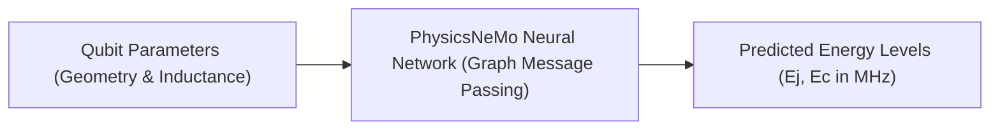

# PhysicsNeMo Surrogate Modeling

The `train_surrogate.py` script trains a custom Graph Neural Network (GNN) surrogate model backed by **NVIDIA PhysicsNeMo**. The surrogate predicts qubit Hamiltonian parameters $[E_j, E_c]$, bypassing the computational cost of full finite-element simulations during genetic algorithm iterations.

---

## Model Architecture & Physics Transforms

The surrogate is implemented as a `MeshGraphNet`-style graph neural network inheriting from `physicsnemo.Module`:



### 1. Log-Space Target & Feature Transforms
- **$E_j$ Target Scaling**: Because Josephson energy scales reciprocally with junction inductance ($E_j \propto 1/L_j$), linear neural networks struggle with extreme curvatures. Training in log space via $\log(E_j)$ linearizes the optimization landscape.
- **$L_j$ Feature Scaling**: Input feature inductance is provided in log scale $\log(L_j)$, preventing vanishing gradients across nano-Henry scales.

### 2. Parameter Identity Node Features
Scalar parameters are encoded as heterogeneous graph nodes with one-hot identity tags, enabling message passing layers to distinguish geometric dimensions from lumped circuit parameters.

### 3. Monte Carlo Dropout Uncertainty
Dropout layers ($p=0.10$) remain enabled in both training and evaluation modes. Running $M$ stochastic forward passes provides predictive variance $\sigma(x)$, quantifying epistemic uncertainty for active learning.

### 4. Validation-Based Early Stopping
Training monitors validation loss and terminates when improvement plateaus (default patience: 200 epochs). The checkpoint with the lowest validation loss is restored before saving.

---

## Training Execution

Train the surrogate on the 70% partition and evaluate on the 20% holdout test partition:

```bash
python train_surrogate.py \
    --data-log training_run/training_data/train_samples.csv \
    --test-log training_run/training_data/test_samples.csv \
    --checkpoint training_run/training_data/checkpoints/nemo_surrogate.mdlus \
    --epochs 2000 \
    --early-stopping-patience 200 \
    --evaluation-output training_run/training_data/checkpoints/training_evaluation.json
```

### CLI Arguments

| Flag | Default | Description |
| :--- | :---: | :--- |
| `--data-log` | `active_learning_log.csv` | Input training CSV containing measured samples. |
| `--test-log` | `None` | Independent test CSV evaluated strictly post-training. |
| `--checkpoint` | `nemo_surrogate.mdlus` | Destination path for trained model weights. |
| `--epochs` | `2000` | Maximum number of training epochs. |
| `--early-stopping-patience` | `200` | Epochs without validation improvement before early stopping. |
| `--validation-split` | `0.2` | Fraction reserved internally if evaluating a single CSV. |
| `--accuracy-tolerance-percent`| `5.0` | Relative error tolerance threshold for accuracy score. |
| `--evaluation-output` | `None` | JSON file destination for complete metric report. |

---

## Checkpoint Artifacts

Upon completion, `train_surrogate.py` writes three complementary artifacts:

```text
training_data/checkpoints/
├── nemo_surrogate.mdlus             # PhysicsNeMo model architecture and weights
├── nemo_surrogate.state.pt          # Normalization bounds, optimizer state, and version tag
└── training_evaluation.json         # Comprehensive metrics report
```

### Evaluation Report Format

`training_evaluation.json` contains quantitative validation and test metrics:

```json
{
  "train_samples": 105,
  "validation_samples": 15,
  "epochs_trained": 1842,
  "status": "converged",
  "validation_metrics": {
    "ej_mae_mhz": 45.57,
    "ec_mae_mhz": 0.005,
    "ej_accuracy_percent": 100.0,
    "ec_accuracy_percent": 100.0,
    "ej_precision": 1.0,
    "ej_recall": 1.0,
    "ej_f1": 1.0
  },
  "independent_test": {
    "test_samples": 30,
    "ej_mae_mhz": 48.21,
    "ec_mae_mhz": 0.006,
    "ej_accuracy_percent": 100.0,
    "ec_accuracy_percent": 100.0
  }
}
```
