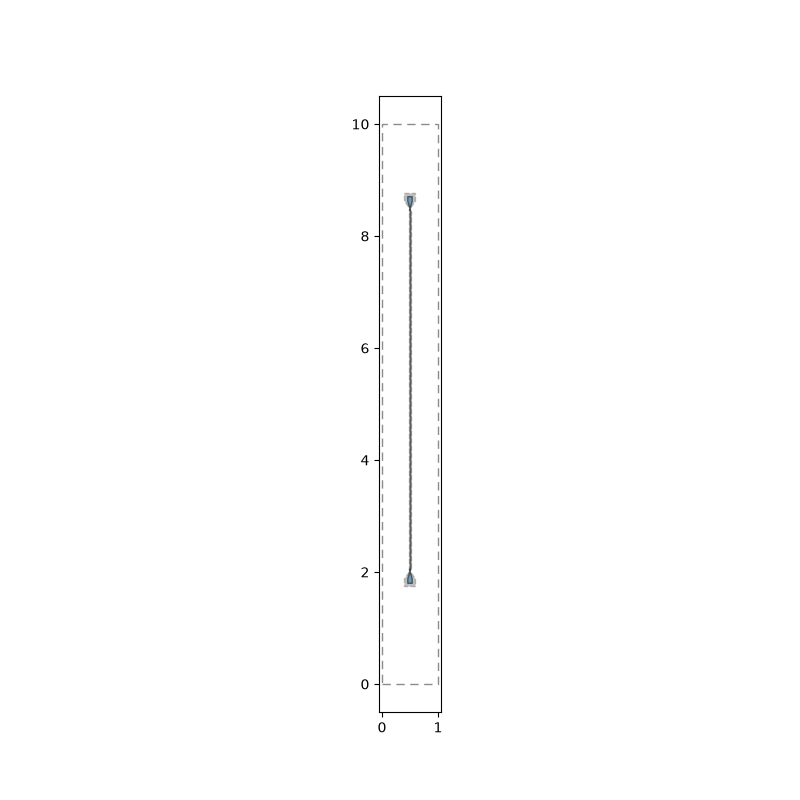

# metal-flow

## Portable setup

This recipe uses Python 3.11 and installs the checked-out Quantum Metal and
CDAC optimizer projects without embedding machine-specific paths. Palace is an
external CPU-capable executable; install it with Spack or build it from the
[Palace installation guide](https://awslabs.github.io/palace/dev/install/).

```bash
cd /path/to/CDAC
python3.11 -m venv .venv
source .venv/bin/activate
python -m pip install --upgrade pip

# Select CUDA-capable PyTorch when an NVIDIA GPU is available; otherwise use CPU wheels.
if command -v nvidia-smi >/dev/null 2>&1 && nvidia-smi -L >/dev/null 2>&1; then
  python -m pip install -r Opt/Quantum_Opt_Pipeline/requirements.txt
else
  python -m pip install -r Opt/Quantum_Opt_Pipeline/requirements-cpu.txt
fi
python -m pip install -e "quantum_design_env/quantum-metal[mesh]"
python -m pip install -e quantum_design_env/SQDMetal
python -m pip install -e Opt/Quantum_Opt_Pipeline --no-deps

spack install palace
export PALACE_BIN="$(spack location -i palace)/bin/palace"
export PATH="$(dirname "$PALACE_BIN"):$PATH"
which mpirun
which gmsh
"$PALACE_BIN" --help >/dev/null
```

When no usable NVIDIA GPU is detected, `requirements-cpu.txt` selects the
official PyTorch CPU wheel index. The optimizer automatically selects MPS,
CUDA, or CPU at runtime.

Run unit tests or a Palace smoke test from the repository root:

```bash
# Run unit tests
python -m pytest Opt/Quantum_Opt_Pipeline/tests -q

# Or run a 1-sample Palace generation smoke test
python Opt/Quantum_Opt_Pipeline/generate_samples.py \
  --output-root smoke_test_run \
  --samples 1 \
  --palace-bin "$PALACE_BIN"
```

## Design textual diagram

```
  p0                                                      p1
  |                                                       |
  |                                                       |
  |                                                       |
ctl0  ---  r0  ---  q0-------c01------q1  ---  r1  ---  ctl1
  |                  |                 |                  |
  |                  |                 |                  |
  |                  |                 |                  |
  |                  |                 |                  |
  |                  |                 |                  |
ctl2  ---  r2  ---  q2------c23-------q3  ---  r3  ---  ctl3
  |                                                       |
  |                                                       |
  |                                                       |
  p2                                                      p3

```

## Diagram


